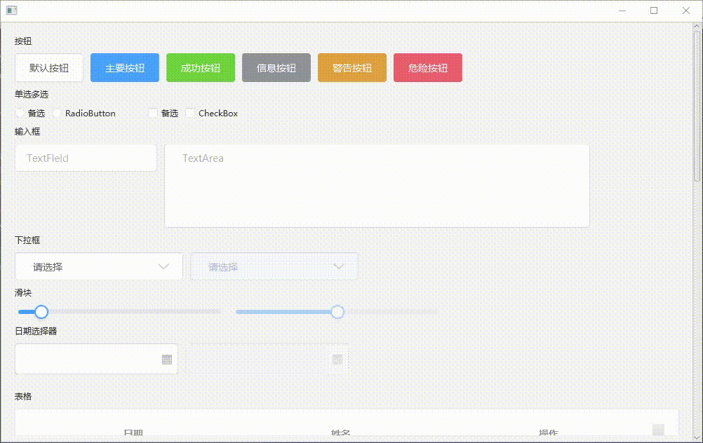
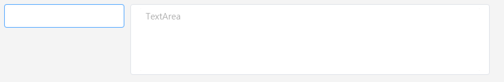
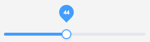
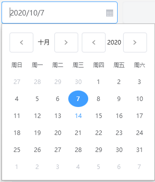
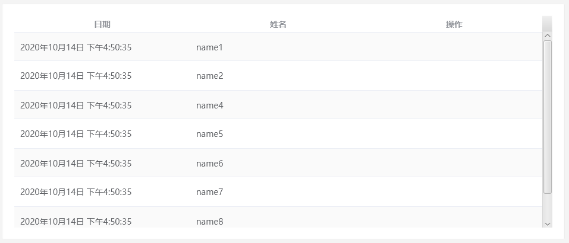
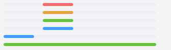
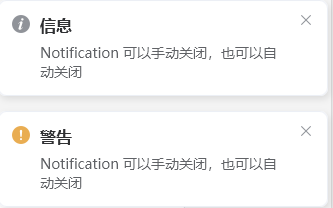
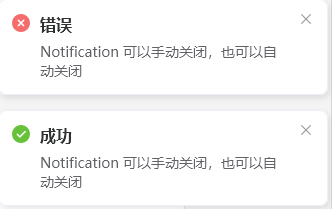
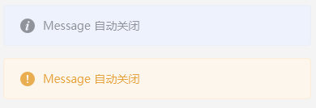
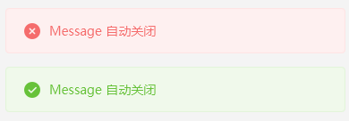

# easyfx 示例

[easyfx](https://github.com/xizi110/easyfx)




Application中调用`setElementStyleEnable`()，需要在程序运行前设置

```java
// 启用elementUI
setElementStyleEnable(true);
ExampleView view = View.createView();
....
```

Button

styleClass分别对应 `.button .button-pramary .button-success .button-info .button-warning .button-danger`


RadioButton Checkbox


TextField TextArea



ComboBox


EleSlider（修改自jfoenix JFXSlider）



DatePicker



TableView



ProgressBar

styleClass分别对应 `progress-bar-exception .progress-bar-warning .progress-bar-success .progress-bar`



ProgressIndicator

styleClass分别对应 `.progress-indicator .progress-indicator-success .progress-indicator-exception .progress-indicator-warning`


Notification

styleClass分别对应 .notification-info .notification-error.notification-warning .notification-success 

Message

styleClass分别对应 .message-info .message-error.message-warning .message-success 

